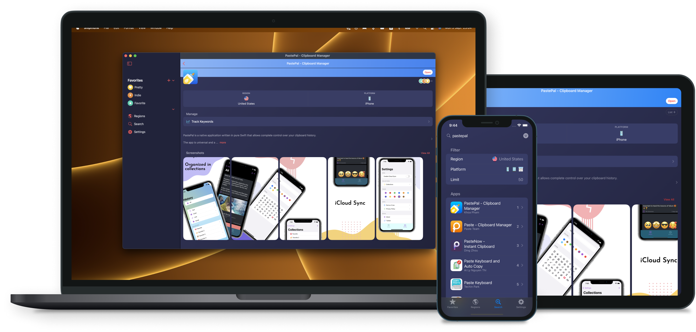
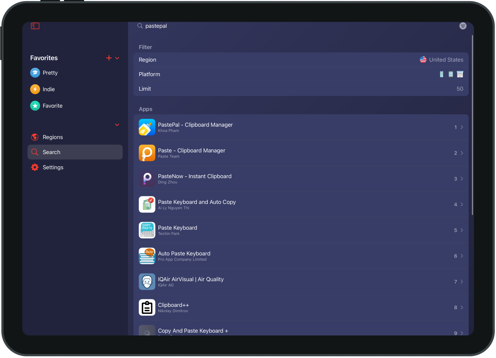
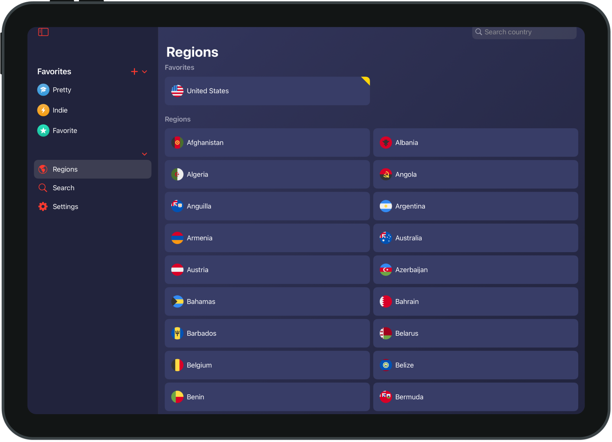
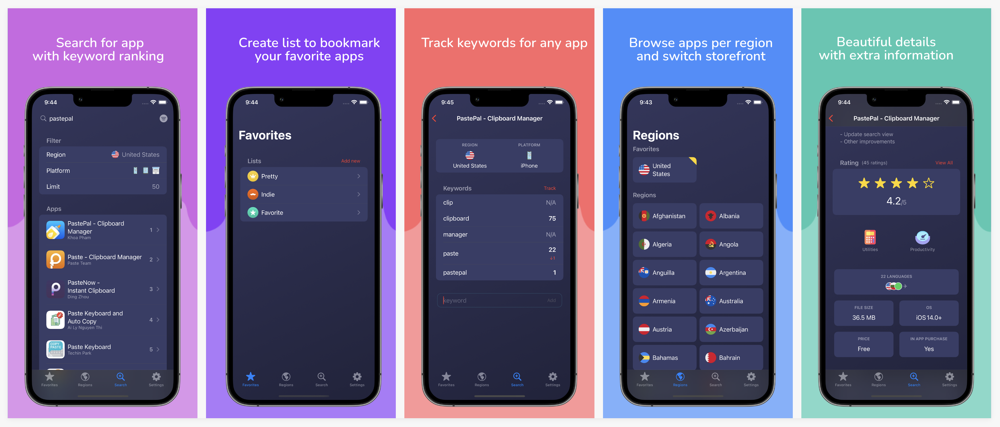

    <h2>Shipmunk - ASO</h2>
    
Powerful app manager and ASO tracker. Search, bookmark and track keyword rating for your favorite apps

    
    

  

    <!-- platform -->
    
    
    <!-- social -->
    

 

 

<h1>Features</h1>

- ✅ Native: Written in Swift for iPhone and iPad.
- ✅ Universal: Universal purchase. Support Mac, iPhone and iPad apps. Sync with iCloud across all your devices
- ✅ Powerful app tracking: Search and bookmark your favorite apps
- ✅ ASO tracking: Experiment with keywords and track ranking
- ✅ Privacy focused: No tracing. All data remains locally and logic is done on device.

 

<h1>Search with keyword ranking</h1>

 

 

- Search by app name and keyword: Show apps result with ranking
- Bookmark: Create list to bookmark your favorite apps
- Beautiful app detail: Highlighting ratings and reviews
- Save screenshots: View and download app screenshots

 

<h1>Browse apps per region</h1>

 

 

- Localized: View app details in regional locale
- Switch storefront: Switch Appstore storefront
- Favorite regions: Favorite regions to easily browse later
- Top chart: View top free, top paid and top grossing apps

 

<h1>Convenient iPhone app</h1>
Manage your favorie apps on the go

 

 

<h1>Support</h1>

- Have a problem? Please open a GitHub issue
- Visit homepage https://onmyway133.com/shipmunk/ for more information

Shipmunk is done by a 2 persons indie development team and your support helps keep the project going. Thanks for checking out and have a nice day 😇